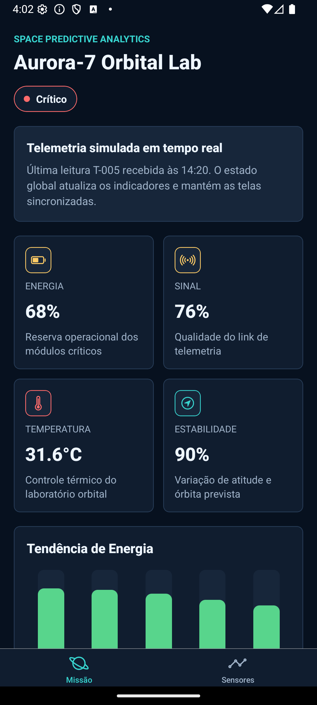
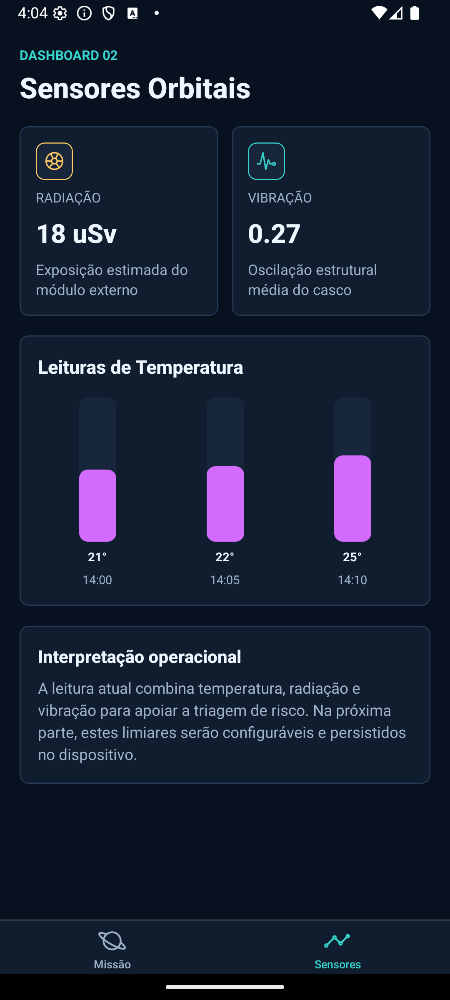
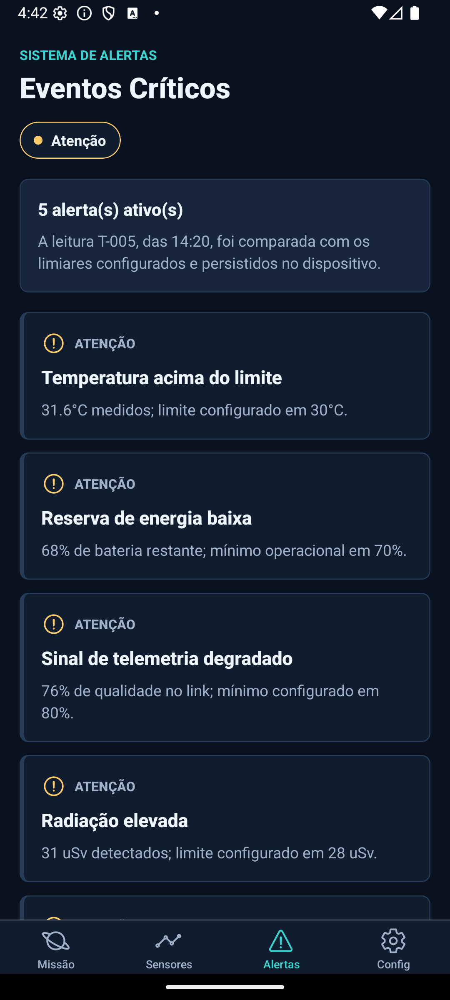
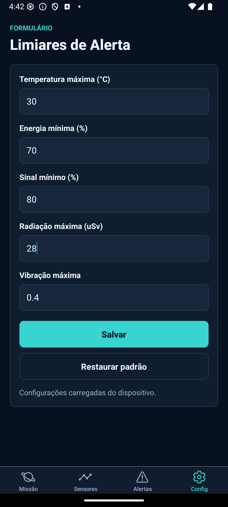
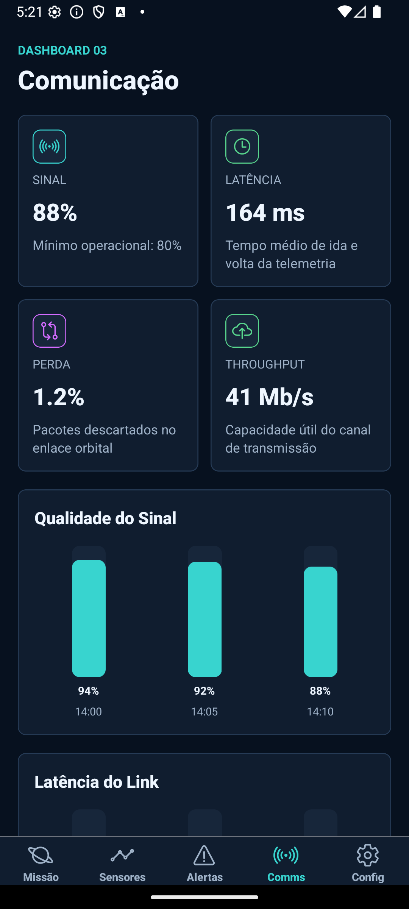

# 🪐 EcoDart Mission
### Global Solution 2026.1 — Cross-Platform Application Development | FIAP


EcoDart Mission é um aplicativo mobile de Space Predictive Analytics para monitoramento de uma missão espacial simulada. A solução acompanha dados de energia, sensores orbitais, comunicação e estabilidade operacional da missão Aurora-7, gerando alertas automáticos a partir de limiares críticos configuráveis. O app foi desenvolvido com React Native, Expo Router, Context API, dados mockados em tempo quase real e persistência local com AsyncStorage.

### 🎥 Project Vídeo

[](https://youtu.be/6Vmzjm9OnFo)

## Equipe

| Nome | RM |
|------|----|
| Arthur Reis Batista da Silva | 562181 |
| Carolina Monteiro Bernardo | 564651 |
| Leonardo de Magalhães Piassa | 563663 |

## Objetivo

O desafio propõe uma plataforma inteligente para monitoramento de sistemas espaciais e operações orbitais simuladas. Este app resolve esse cenário por meio de dashboards analíticos, indicadores visuais, interpretação operacional e alertas baseados em limites críticos.

## Telas do Aplicativo

### Missão — Dashboard Principal



Visão geral da missão com energia, sinal, temperatura, estabilidade orbital, status operacional e tendência de energia.

### Sensores — Dashboard de Sensores



Monitoramento de temperatura, radiação e vibração estrutural com gráficos de leituras simuladas.

### Alertas — Eventos Críticos



Lista de alertas ativos gerados automaticamente a partir dos limiares configurados pelo usuário.

### Configurações — Formulário de Limiares



Formulário validado para configurar limites de temperatura, energia, sinal, radiação e vibração. As configurações são persistidas com AsyncStorage.

### Comunicação — Dashboard de Comunicação



Dashboard com qualidade do sinal, latência, perda de pacotes e throughput do enlace de telemetria orbital.

## Funcionalidades

- [x] Navegação com Expo Router usando Tabs
- [x] Dashboard principal da missão
- [x] Dashboard de sensores orbitais
- [x] Dashboard de comunicação
- [x] Dados simulados com atualização automática
- [x] Context API para estado global da missão
- [x] Context API consumida em múltiplas telas
- [x] Sistema de alertas por limiares críticos
- [x] Formulário com inputs controlados
- [x] Validação e feedback visual de erro
- [x] Persistência de configurações com AsyncStorage
- [x] Interface temática espacial em dark mode
- [x] Código organizado em componentes reutilizáveis

## Dashboards Implementados

| Dashboard | Dados exibidos | Arquivo |
|-----------|----------------|---------|
| Missão | Energia, sinal, temperatura, estabilidade orbital | `app/index.tsx` |
| Sensores | Radiação, vibração, temperatura | `app/sensors.tsx` |
| Comunicação | Sinal, latência, perda de pacotes, throughput | `app/communication.tsx` |

## Sistema de Alertas

Os alertas são gerados automaticamente no `MissionContext` comparando a telemetria atual com os limiares configurados:

| Métrica | Regra |
|---------|-------|
| Temperatura | Alerta quando ultrapassa a temperatura máxima |
| Energia | Alerta quando fica abaixo da bateria mínima |
| Sinal | Alerta quando fica abaixo da qualidade mínima |
| Radiação | Alerta quando ultrapassa o limite máximo |
| Vibração | Alerta quando ultrapassa a vibração máxima |

Cada alerta recebe severidade `Atenção` ou `Crítico`, e o status geral da missão é atualizado automaticamente.

## Arquitetura

```text
.
├── app/
│   ├── _layout.tsx          # Navegação com Expo Router Tabs
│   ├── index.tsx            # Dashboard principal
│   ├── sensors.tsx          # Dashboard de sensores
│   ├── communication.tsx    # Dashboard de comunicação
│   ├── alerts.tsx           # Tela de alertas
│   └── settings.tsx         # Formulário de limiares
├── components/
│   ├── AlertCard.tsx
│   ├── MetricCard.tsx
│   ├── SectionHeader.tsx
│   ├── StatusPill.tsx
│   └── TelemetryChart.tsx
├── context/
│   └── MissionContext.tsx   # Estado global, telemetria e alertas
├── data/
│   └── missionTelemetry.ts  # Mock de dados espaciais
├── storage/
│   └── settingsStorage.ts   # Persistência com AsyncStorage
├── theme/
│   └── colors.ts
└── statics/
    └── prints do aplicativo
```

## Tecnologias

- React Native
- Expo
- Expo Router
- TypeScript
- Context API
- AsyncStorage
- Expo Vector Icons
- React Hooks: `useState`, `useEffect`, `useMemo`, `useContext`

## Como Executar

### Pré-requisitos

- Node.js instalado
- npm instalado
- Expo Go instalado no celular, ou emulador Android/iOS configurado

Recomendação: use Node.js LTS. Caso a CLI do Expo apresente erro de porta com Node 22, rode com Node 20.

### Instalação

```bash
npm install
```

### Executar o app

```bash
npm start
```

Depois, escaneie o QR Code com o Expo Go ou use as opções do terminal:

```text
a = Android
i = iOS
w = Web
```

### Limpar cache do Expo

```bash
npx expo start -c
```

## Validação

Verificação de TypeScript:

```bash
npm run typecheck
```

Validação de bundle Android realizada:

```text
Android Bundled node_modules/expo-router/entry.js
```

## Desenvolvimento em Partes

- [x] Parte 1: base do projeto, navegação, estado global, dashboard principal e dashboard de sensores
- [x] Parte 2: persistência com AsyncStorage, formulário de configuração e regras completas de alertas
- [x] Parte 3: dashboard de comunicação, README final, arquivo de entrega e polimento

## Licença

Projeto desenvolvido para fins acadêmicos — FIAP 2026.
